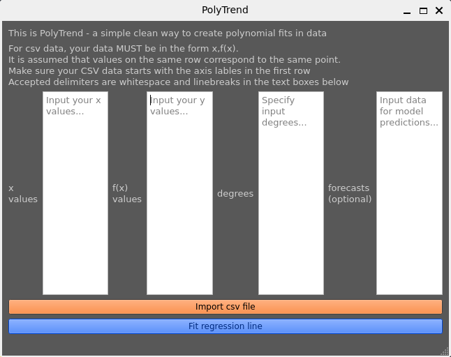
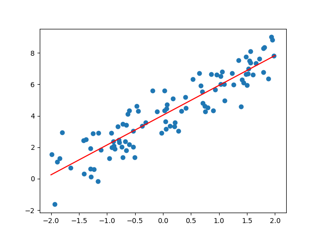

<p align="center">
  
</p>

# Table of Contents

1. [Introduction](#introduction)
   - [Key Functionalities](#key-functionalities)
   - [Use Cases](#use-cases)
2. [License](#license)
3. [Installation](#installation)
   - [From release page](#from-release-page)
   - [From pip (CLI version)](#from-pip-cli-version)
   - [From source](#from-source)
4. [Testing](#testing)
5. [Theory](#theory)
   - [Polynomial Regression](#polynomial-regression)
   - [Model Selection](#model-selection)
6. [Additional Resources](#additional-resources)
7. [Future Improvements](#future-improvements)

## Introduction

PolyTrend is a Python application for polynomial trend fitting, visualization, and extrapolation. It fits a polynomial to a set of data points using regression, selects the best-fit degree via the Bayesian Information Criterion (BIC), and plots the result alongside any requested extrapolations.

<table>
  <tr>
    <td align="center">
      <br>
      <sub>Application UI</sub>
    </td>
    <td align="center">
      <br>
      <sub>Generated polynomial trend graph</sub>
    </td>
  </tr>
</table>

## Key Functionalities

- **polyplot()**: Entry point. Runs `polyfind()` then `polygraph()` on the data.
- **polyfind()**: Fits each candidate degree, selects the best by BIC, and prints a statistical report (R², adjusted R², AIC, BIC, MSE, RMSE, MAE, residual stats).
- **polygraph()**: Plots the known data, fitted curve, and extrapolated points if provided.

## Use Cases

1. **Trend analysis**: Identify the underlying polynomial structure in a dataset.
2. **Visualization**: Overlay the fitted curve on the original data points.
3. **Extrapolation**: Project the fitted function beyond the observed range.

## License

This project is governed by the **GNU General Public License version 3 (GNU GPL v3)**.
See the [COPYING](./COPYING) file for full terms.

## Installation

### From release page

Visit the [PolyTrend release page](https://github.com/asiimwemmanuel/polytrend/releases) and download the appropriate package for your platform (ZIP for Windows, DMG for macOS, GZ for Linux). Extract it and follow the included instructions.

### From pip (CLI version)

```bash
pip install polytrend
```

#### Example Usage

```python
import random
import polytrend as pt

degrees = [1, 2, 3]
data = [
  (float(x), float(0.5 * x**2 - 2 * x + 1 + random.uniform(-1000, 1000)), 1.0)
  for x in range(0, 100)
]

pt.polyplot(degrees, data, extrapolate_data=[112, 140])
```

### From source

#### 1. Install [Python](https://www.python.org/downloads/) and [Git](https://git-scm.com/downloads).

#### 2. Install `freeglut3-dev`

| Platform        | Command                              |
| --------------- | ------------------------------------ |
| macOS (brew)    | `brew install freeglut`              |
| Windows (choco) | `choco install freeglut`             |
| Debian/Ubuntu   | `sudo apt-get install freeglut3-dev` |
| Fedora          | `sudo dnf install freeglut-devel`    |
| Red Hat/CentOS  | `sudo yum install freeglut-devel`    |
| Arch Linux      | `sudo pacman -S freeglut`            |
| openSUSE        | `sudo zypper install freeglut-devel` |

#### 3. Clone and set up the project

```shell
git clone --depth 1 https://github.com/asiimwemmanuel/polytrend.git
cd polytrend
poetry sync
```

#### 4. Run the app

```shell
uv run src/main.py
```

> **Linux note**: If GUI issues persist, see [Qt setup for Linux](https://web.stanford.edu/dept/cs_edu/resources/qt/install-linux).

## Testing

The test suite lives in `tests/` and requires only `pytest`. No GUI or display is needed — matplotlib calls are mocked throughout.

```shell
# generate fixture CSVs (only needed once, or after changing fixture parameters)
python tests/generate_fixtures.py

# run the full suite
poetry run pytest tests/ -v
```

The fixtures are deterministic (fixed random seed) and checked into the repo. If you change `generate_fixtures.py`, re-run it and commit the updated CSVs alongside.

For the methodology behind what is tested and why, see [docs/testing.md](./docs/testing.md).

## Theory

> See [theory.md](./docs/theory.md) for more in-depth musings

### Polynomial Regression

Given _n_ data points _(x, f(x))_, polynomial regression approximates the relationship as:

```math
f(x_i) = \beta_0 + \beta_1 x_i + \beta_2 x_i^2 + \cdots + \beta_m x_i^m + \varepsilon_i
```

where _m_ is the polynomial degree, each β is a coefficient, and ε is random error. The coefficients are estimated by solving the normal equation:

```math
\widehat{\vec{\beta}} = (\mathbf{X}^\mathsf{T} \mathbf{X})^{-1} \mathbf{X}^\mathsf{T} \vec{y}
```

When error values are provided, PolyTrend switches to Ridge regression with inverse-error sample weights, trading the exact normal equation solution for regularized stability.

### Model Selection

Evaluating multiple polynomial degrees with MSE alone consistently favours the highest degree — a consequence of overfitting. PolyTrend uses the Bayesian Information Criterion (BIC) instead:

```math
\text{BIC} = n \cdot \ln(\text{MSE}) + k \cdot \ln(n)
```

where _n_ is the number of data points and _k_ is the number of model parameters. The first term rewards accuracy; the second penalizes complexity. The degree with the lowest BIC is selected. A perfect fit (MSE = 0) is treated as the global minimum.

> See also: [BIC — Wikipedia](https://en.wikipedia.org/wiki/Bayesian_information_criterion), [Polynomial Regression — Wikipedia](https://en.wikipedia.org/wiki/Polynomial_regression)

## Additional Resources

### Articles

- [Polynomial Regression](https://en.wikipedia.org/wiki/Polynomial_regression)
- [Regression Analysis](https://en.wikipedia.org/wiki/Regression_analysis)
- [Bayesian Information Criterion](https://en.wikipedia.org/wiki/Bayesian_information_criterion)

### Videos

- [Polynomial Regression in Python](https://youtu.be/H8kocPOT5v0?feature=shared)
- [Polynomial Regression in Python — sklearn](https://youtu.be/nqNdBlA-j4w?feature=shared)

## Possible Improvements

- **Batch plotting**: Fit and plot multiple datasets in a single run.
- **Data normalization**: Normalize inputs before fitting to improve numerical stability at high degrees.
- **Parallelization**: Evaluate candidate degrees concurrently.
- **Cross-validation**: Use k-fold CV as a secondary selection criterion to guard against overfitting on small datasets.
- **Caching**: Skip redundant `_read_main_data` calls when the same dataset is passed across `polyfind` and `polygraph`.
