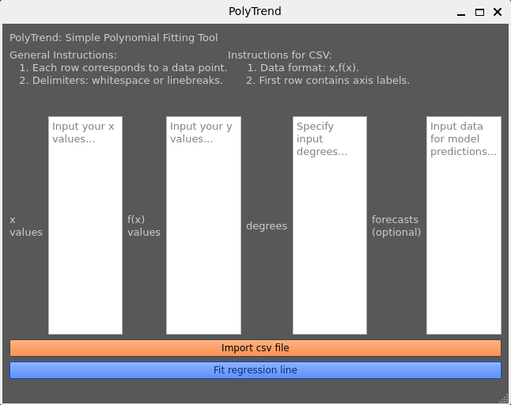

<!-- update master branch with deploy, delete deploy ONLY AFTER JMUKS FINISHES -->
<!-- using upx to shrink executable -->

<!-- # PolyTrend 📈 -->
<p align="center">
    
</p>
<!--  -->

# Table of Contents

1. [Introduction](#introduction-)
   - [Key Functionalities](#key-functionalities-)
   - [Use cases](#use-cases-)
2. [License](#license-)
3. [Installation](#installation-)
   - [From release page](#from-release-page)
   - [From pip (CLI version)](#from-pip-cli-version)
   - [From source](#from-source)
4. [Theory](#theory-)
   - [Quadratic Sequences](#quadratic-sequences)
   - [Lagrange Interpolation](#lagrange-interpolation)
   - [Polynomial Regression](#polynomial-regression)
   - [Model Selection](#model-selection)
5. [Additional Resources](#additional-resources-)
   - [Articles](#articles)
   - [Videos](#videos)
6. [Future Improvements](#future-improvements-)
   - [Batch Plotting](#-batch-plotting)
   - [Data Normalization](#-data-normalization)
   - [Parallelization](#-parallelization)
   - [Cross-Validation](#-cross-validation)
   - [Regularization](#-regularization)
   - [Caching](#-caching)

## Introduction 💡

PolyTrend is a Python app aimed at facilitating polynomial trend fitting, visualization, and extrapolation. It offers a comprehensive set of functionalities to analyze and interpret data using polynomial regression techniques. Its development provides insights and conclusions in the fields of interpolation, polynomial regression and approximation theory.

<div style="display:flex; justify-content:center;">
    <div style="flex:1; text-align:center;">
        
    </div>
    <div style="flex:1; text-align:center;">
        
    </div>
</div>

## Key Functionalities 🔑

PolyTrend offers the following key functionalities:

- **polyplot()**: This method plots the polynomial fit based on specified degrees of the polynomial and the provided data.
- **polyfind()**: This method calculates the best-fit polynomial function by evaluating different polynomial degrees and selecting the one with the lowest Bayesian Information Criterion (BIC) score.
- **polygraph()**: This method visualizes the polynomial function, the known data points, and any extrapolated data points if provided.

## Use cases 📋

Users can utilize PolyTrend to perform the following tasks:

1. **Data Analysis**: Analyze trends and patterns within datasets using polynomial regression techniques.
2. **Visualization**: Visualize polynomial fits alongside original data points to gain insights into the relationship between variables.
3. **Extrapolation**: Extrapolate future values based on the fitted polynomial function, enabling predictive modeling tasks.

## License ⚖️

This project is governed by the **GNU General Public License version 3 (GNU GPL v3)**.
For detailed terms and conditions, please refer to the [COPYING](./COPYING) file included within the project repository.

## Installation ⚙️

<!-- methods to include: source (suitable for modification/customization), python package index (suitable for usage in projects), docker image (suitable for running in a VM), installation wizard with binary(suitable for standalone releases) -->

### From release page


1. Visit the [PolyTrend release page](https://github.com/asiimwemmanuel/polytrend/releases) and download the relevant release package (ZIP for Windows, DMG for macOS, GZ for Linux).

2. Extract the downloaded package to a directory of your choice.

3. Navigate to the extracted directory in your file explorer.

4. Locate the installation instructions file included in the extracted package. This file typically contains detailed instructions on how to set up and run PolyTrend.

5. Follow the instructions provided in the file to install and run PolyTrend. Make sure to pay attention to any specific requirements or recommendations mentioned in the instructions.

### From pip (CLI version)

```bash
pip install polytrend
```

#### Example Usage

```python
import random
import polytrend as pt

# sample input
degrees = [1, 2, 3]
data = [
    (float(x), float(0.5 * x**2 - 2 * x + 1 + random.uniform(-1000, 1000)))
    for x in range(0, 100)
]

# Fit polynomial and visualize
pt.polyplot(degrees, data, extrapolate_data=[112, 140])
```

### From source

#### 1. Install [Python](https://www.python.org/downloads/) and [Git](https://git-scm.com/downloads) if not already installed on your system.

#### 2. Install `freeglut3-dev`

> - **macOS (brew)**:
>```bash
>    brew install freeglut
>```
> - **Windows (chocolatey)**:
>```bash
>    choco install freeglut
>```
> - **Debian/Ubuntu (apt)**:
>```bash
>    sudo apt-get install freeglut3-dev
>```
> 
> - **Fedora (dnf)**:
>```bash
>    sudo dnf install freeglut-devel
>```
> 
> - **Red Hat/CentOS (yum)**:
>```bash
>    sudo yum install freeglut-devel
>```
> 
> - **Arch Linux (pacman)**:
>```bash
>    sudo pacman -S freeglut
>```
> 
> - **openSUSE (zypper)**:
>```bash
>    sudo zypper install freeglut-devel
>```

#### 3. Set up the virtual environment (via [pyenv](https://github.com/pyenv/pyenv)):

```shell
git clone --depth 1 https://github.com/asiimwemmanuel/polytrend.git
cd polytrend
pyenv virtualenv venv_name # or python -m venv venv_name
```

Replace `venv_name` with the desired name for your virtual environment.

#### 4. Activate the virtual environment:

- On **Windows**:

```shell
venv_name\Scripts\activate
```

- On **Unix or MacOS**:

```shell
pyenv activate venv_name # or source venv_name/bin/activate
```

#### 5. Verify and set the Python version specified in `.python-version`:

```shell
pyenv local $(cat .python-version)
```

#### 6. Install required dependencies:

```shell
pip install -r requirements.txt
```

#### 7. Run the app:

```shell
python main.py
```

> Note for linux: If GUI issues persist, visit [this website](https://web.stanford.edu/dept/cs_edu/resources/qt/install-linux) and follow the instructions to configure Qt on your system

<!-- ### From the python packaging index * -->

<!-- To install polytrend **as a package**, follow these instructions:

- Install [Python](https://www.python.org/downloads/) if it is not already installed on your system. 💻

- Install the package:

```shell
pip install polytrend
```
-->

<!-- ### From a docker image

This will soon be available... -->

<!-- ### From a standalone release/binary

To install polytrend via a wizard, see [Releases](https://github.com/asiimwemmanuel/polytrend/releases)-->

<!-- Note: If you are using WSL or a GUI incapable OS, install an X11 server like vcxsrv and link your forwarding instance with your terminal session.
Do so only if the app fails to run in case you installed it from source -->

## Theory 📚

### Quadratic Sequences

For a quadratic sequence conforming to the structure $ a, b, c $, wherein:

- $ \alpha = b - a $
- $ \beta = c - b $
- $ x = \beta - \alpha $,

it becomes evident that $ \alpha $ and $ \beta $ collectively engender a linear sequence, delineated as:

```math
xn + (\alpha - x)
```

or equivalently:

```math
\alpha + \sum_{i=1}^{n-1}x
```

In delineating the foundational stratum (denoted as $ x $) within the context of the disparity tableau, it is apposite to attribute to it a degree of 0, thereby characterizing it as a constant. Consequently, the linear progression manifests as an amalgamation of $ x_i $ and the inaugural term. Indeed, the derivation of the nth term at any given degree necessitates a retrospective computation of the substratal strata. Employing analogous rationale, it becomes apparent that quadratic sequences (and, by extension, sequences of other orders) can be deduced by effectuating the summation of their primary term, denoted as $ a $, with a discernible combination of substratal variables.

Asiimwe's general form of quadratic nth term problems may be derived as:

```math
    a + \sum_{i=1}^{n-1}\alpha + x(i-1)
```

<!-- also comment about how this ties into Sequences and series, and general formulae for calculating summations -->

The formulated expression is inherently tailored to address linear and quadratic sequences, thereby necessitating an alternative approach for sequences of higher degrees. Notably, upon scrutiny of Asiimwe's equation, a discernible pattern emerges. It is conjectured that said expression itself serves as the subject of summation for cubic dilemmas, while this newly derived expression assumes the role of the subject of summation for quartic predicaments. Evidently, a recursive pattern manifests within this methodology when extending its application to problems characterized by varying degrees.

A paragonal solution to the recursive conundrum at hand is conceivable, particularly when considering the nth sequence. Such a solution possesses a versatility that extends to sequences of complexities ranging from n-r;

```math
    \text{For } r \in \mathbb{Z}, 1 \leq r \leq n-1
```

It is also intriguing to consider a framework wherein descending through the layers in this framework resembles differentiation, where each step involves deriving successive terms. Conversely, ascending through the layers mirrors integration, accumulating terms to reconstruct the original sequence. This analogy provides insight into the interplay of discrete elements, akin to calculus principles.

**HYPOTHESIS**: Upon representing the sequence with a polynomial, it is conjectured that the $ f^{(d)} $ derivative assumes a constant value, thereby equating the bottommost layer.

Efforts to exploit this property for constructing the `quadseq` via Calculus, with the aim of devising a comprehensive methodology applicable to problems of all degrees, encountered setbacks. Attempts to integrate (progress upwards) from the lower strata resulted in the loss of pertinent information, including constants and additional terms. Consequently, this led to alterations in the plots of the primary sequence and its integrated counterpart.

As of yet, the untested hypothesis to recover this lost information involves either scrutinizing the complete primary and integrated sequences (while acknowledging the transformation between them) to discern the directed (i.e., not absolute) phase in each sequence term, or identifying such a phase at each step of the integration process rather than solely at its culmination. Both approaches facilitate the retrieval of the missing information, aiding in the deduction of absent polynomial constants. However, it should be noted that this task poses greater challenges when addressing other types of lost function terms.

<!-- TODO: include an example of the hypothesis -->

### Lagrange Interpolation

Lagrange interpolation, primarily employed for in-bound approximation, possesses properties conducive to solving nth-term problems without introducing error.

The Lagrange interpolation formula is expressed as:

```math
    P(x) = \sum_{i=0}^{n} \left( y_i \prod_{j=0, j \neq i}^{n} \frac{x - x_j}{x_i - x_j} \right)
```

Herein:

- $ P(x) $ denotes the polynomial of degree $ n $ (where $ n $ signifies the number of data points).
- $ y_i $ represents the y-coordinate of the $ i^{th} $ data point.
- $ x_i $ signifies the x-coordinate of the $ i^{th} $ data point.

This formula computes the lowest-order polynomial $ P(x) $ that traverses through the provided data points $ x_i, y_i $. It employs a weighted summation of Lagrange basis polynomials to interpolate the function or estimate the value at a specific point $ x $, where $ x $ corresponds to $ n $.

**Note**: The $ n $ in the formula does not correlate with the polynomial degree $ q $ referenced in the preceding section.

> For more information on the Lagrange polynomial, refer to the [Lagrange polynomial Wiki](https://en.wikipedia.org/wiki/Lagrange_polynomial).

To enhance error tolerance and broaden applicability to real-world data, an augmentative technique is incorporated.

### Polynomial Regression

<!-- talking point: matrices solve the least squares problem and how matrices are really applicable for a variety of problems beyong this one -->

Polynomial regression serves as a transition from discrete to continuous data, rendering it suitable for real-world data analytics scenarios characterized by inherent error. It offers a nuanced balance between accuracy and versatility across diverse applications.

In the context of a set comprising $ n $ data points $ (x, f(x)) $, the polynomial function of degree $ m $ is approximated as:

```math
    f(x_i) = \beta_0 + \beta_1 x_i + \beta_2 x_i^2 + \cdots + \beta_m x_i^m + \varepsilon_i \quad \text{(for } i = 1, 2, \ldots, n \text{)}
```

In this formulation, $ m $ denotes the chosen maximum power, each $ \beta_i $ signifies a coefficient within the function, and $ \varepsilon_i $ represents random error.

The approximation is determined by solving for $\vec{\beta}$ in the matrix equation:

```math

    \begin{bmatrix}
        1 & x_0 & x_0^2 & \dots & x_0^m \\
        1 & x_1 & x_1^2 & \dots & x_1^m \\
        1 & x_2 & x_2^2 & \dots & x_2^m \\
        \vdots & \vdots & \vdots & \ddots & \vdots \\
        1 & x_n & x_n^2 & \dots & x_n^m
    \end{bmatrix}
    \cdot
    \begin{bmatrix}
        \beta_0\\
        \beta_1\\
        \beta_2\\
        \vdots \\
        \beta_m
    \end{bmatrix}
    +
    \begin{bmatrix}
        \varepsilon_0\\
        \varepsilon_1\\
        \varepsilon_2 \\
        \vdots \\
        \varepsilon_n
    \end{bmatrix}
    =
    \begin{bmatrix}
        y_0 \\
        y_1 \\
        y_2 \\
        \vdots \\
        y_n
    \end{bmatrix}

```

The matrix equation $ \mathbf{X} \vec{\beta} + \vec{\varepsilon} = \vec{y}$ is solved using the [Normal Equation](http://mlwiki.org/index.php/Normal_Equation):

```math
    \widehat{\vec{\beta}} = (\mathbf{X}^\mathsf{T} \mathbf{X})^{-1} \mathbf{X}^\mathsf{T} \vec{y} 
```

Where:

- $\widehat{\vec{\beta}}$ is the estimated coefficient vector.
- $\mathbf{X}$ is the matrix of input features.
- $\vec{y}$ is the vector of target values.
- $\mathbf{X}^\mathsf{T}$ denotes the transpose of the input feature matrix.
- $(\mathbf{X}^\mathsf{T} \mathbf{X})^{-1}$ represents the inverse of the covariance matrix of the input features.

Note that the product of the transpose and inverse of the covariance of $ \mathbf{X}$ is also termed the [pseudoinverse](http://mlwiki.org/index.php?title=General_Inverse&action=edit&redlink=1) $\mathbf{X^{+}}$, thus the coefficient vector is the product of the pseudoinverse and the target vector.

Dimensions of the matrices:

- $\mathbf{X}$ is $(n+1)$ by $(m+1)$,
- $\widehat{\vec{\beta}}$ is $(m+1)$ by $1$,
- $\vec{y}$ is $(n+1)$ by $1$.

> For further information on polynomial regression, refer to the [Polynomial regression Wiki](https://en.wikipedia.org/wiki/Polynomial_regression)

### Model Selection

The consistent tendency observed during the implementation of polynomial regression methods in predictive model generation is noteworthy. Specifically, when tasked with selecting the optimal degree for the model, typically between $ a $ and $ b $, the algorithm consistently opts for $ \max(a, b) $. This pattern persists as the algorithm discerns the superior degree to be that which yields a polynomial with a higher score, as gauged by a metric, often Mean Squared Error (MSE) in this context.

Intuitively, this phenomenon aligns with Occam's Razor principle, which posits that simpler solutions are often more preferable. Moreover, it is reasonable to expect programmers to streamline their algorithms to minimize unnecessary computations. Furthermore, this observation has likely been acknowledged within the field, as evidenced by the multitude of responses addressing similar occurrences, a commonality characteristic of such domains.

The Bayesian Information Criterion (BIC) is the most well known, and states:

<!-- ! confirm this formula... it may be invalid -->

```math
     BIC = n \cdot \ln(MSE) + k \cdot \ln(n)
```

Where:

- $ n $ is the number of data points.
- $ MSE $ is the mean squared error.
- $ k $ is the number of parameters in the regression model.

```math
     MSE = \frac{1}{n} \sum_{i=1}^{n} (y_i - \hat{y}_i)^2 
```

Where:

- $ n $ is the number of data points.
- $ y_i $ is the actual value for the $i$-th data point.
- $ \hat{y}_i $ is the predicted value for the $i$-th data point.

The allure of the Bayesian Information Criterion (BIC) lies in its dual function of rewarding accuracy, encapsulated within its first term in the summation, while simultaneously penalizing complexity through its second term. What distinguishes BIC is its additive nature, a departure from the multiplicative relationships prevalent in various scientifically derived quantities, such as velocity, among others. This peculiarity piqued my curiosity, prompting an inquiry into its derivation.

> For more info, see [BIC](https://en.wikipedia.org/wiki/Bayesian_information_criterion)

<!-- find a way to incorporate hypothesis testing, specifically to reject the null hypothesis, and maybe tie connections with linear algebra -->

## Additional Resources 📚🔍

A compilation of articles connected on the mentioned subjects

### Articles
[Polynomial Regression](https://en.wikipedia.org/wiki/Polynomial_regression).
[Regression Analysis](https://en.wikipedia.org/wiki/Regression_analysis)
[Interpolation](https://en.wikipedia.org/wiki/Interpolation)
[Bayesian Information Criterion](https://en.wikipedia.org/wiki/Bayesian_information_criterion)

### Videos
[Lagrange Interpolation](https://youtu.be/bzp_q7NDdd4?feature=shared)
[Polynomial Regression in Python](https://youtu.be/H8kocPOT5v0?feature=shared)
[ Polynomial Regression in Python - sklearn ](https://youtu.be/nqNdBlA-j4w?feature=shared)

## Future Improvements 🚀

### 📈 Batch Plotting:

Batch plotting automates the process of generating multiple plots from a dataset, streamlining visualizations for analysis or reporting purposes. This functionality is particularly useful when dealing with large datasets or when producing numerous plots with similar characteristics.

### 🔢 Data Normalization:

Data normalization is a preprocessing step that scales data to a standard range, enhancing the performance and convergence of machine learning models. By ensuring that all features contribute equally to the analysis, normalization prevents bias towards variables with larger scales, improving the overall robustness of the model.

### ⚙️ Parallelization:

Parallelization divides tasks into smaller subtasks that can be executed simultaneously across multiple processing units. This technique significantly reduces computation time, making it particularly valuable for computationally intensive operations or tasks that lend themselves to parallel execution.

### 🔄 Cross-Validation:

Cross-validation is a validation technique used to assess the performance of predictive models. By partitioning the dataset into multiple subsets and iteratively training and validating the model on different subsets, cross-validation provides a more reliable estimate of the model's performance, helping to identify overfitting and ensure generalization.

### 🛡️ Regularization:

Regularization is a technique used to prevent overfitting in machine learning models by adding a penalty term to the loss function. This penalty discourages overly complex models, promoting simpler models that generalize better to unseen data and improving overall model performance.

### 🔍 Caching:

Caching involves storing frequently accessed data or computations in a temporary storage location to expedite future access. By reducing the need to recompute or retrieve data from slower storage mediums, caching improves performance, especially in applications where certain data or calculations are repeatedly accessed.

## <center>Happy coding! 🥳</center>
